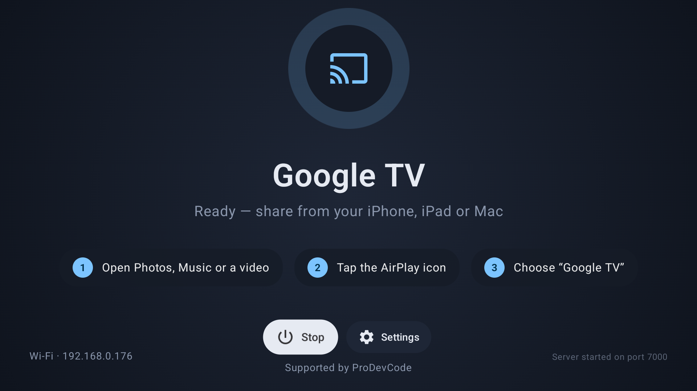
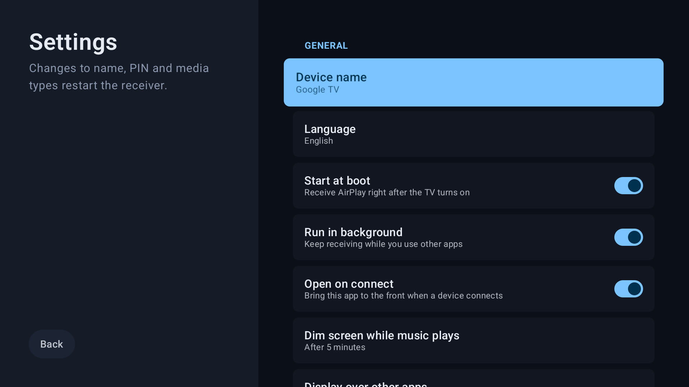
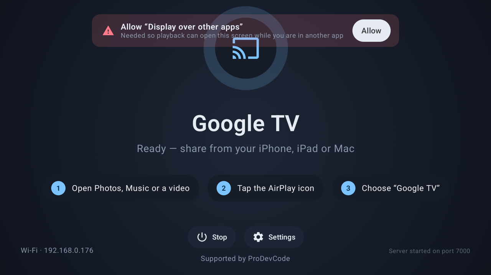
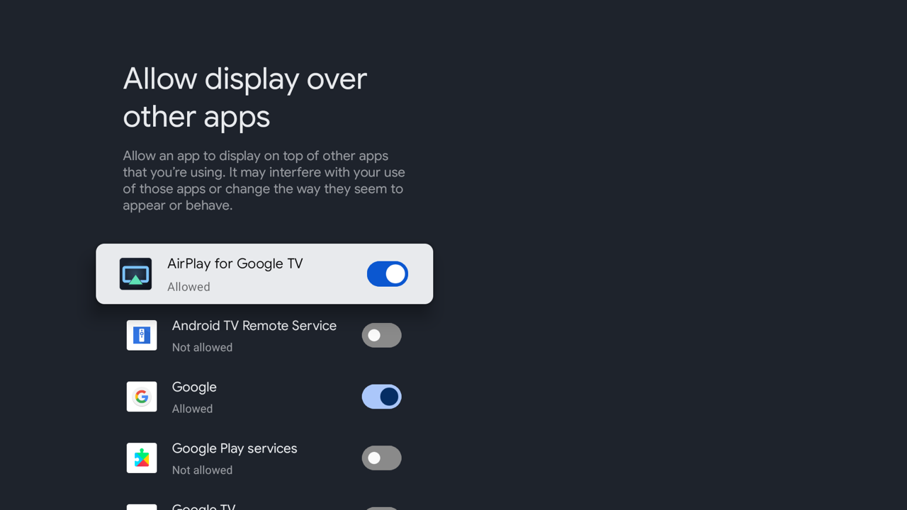

<div align="center">

# AirPlay for Google TV

**Free, open-source AirPlay receiver for Google TV / Chromecast**
Photos, music and video from your iPhone, iPad or Mac — straight to the big screen.

[](https://github.com/mkatadev/GoogleTVAirPlay/releases/latest)
[](https://github.com/mkatadev/GoogleTVAirPlay/actions/workflows/ci.yml)
[](LICENSE)


🇬🇧 English · [🇵🇱 Polski](README.pl.md)



</div>

## Features

- 📺 **Screen mirroring** from iPhone, iPad and Mac
- 🎬 **Video & photos** — the TV plays the stream itself (HLS), with D-pad seeking, **audio track and subtitle selection**
- 🎵 **Music** — shows up as an AirPlay speaker, with cover art and track info
- ⚡ **Hardware decoding** — H.264 and HEVC (H.265) when the TV supports it
- ⏱️ **Latency presets** — Low / Balanced / Smooth, switchable live for games vs. shaky Wi-Fi
- 🔒 **PIN pairing** (on by default) — devices that entered the PIN once are remembered; manage them under *Settings → Trusted devices*
- 🩺 **Diagnostics** screen — receiver, network, mDNS announcement and port checks with plain-language hints; re-announces automatically when the TV changes network
- 🌙 **Screen dimming** while music plays (OLED-friendly); a paused session lets the TV sleep
- 🔁 **Survives short drop-outs** — locking the iPhone no longer ends audio/video playback
- 🚀 **Runs in the background** and **starts at boot** — the TV is always ready to receive
- 🔔 **In-app updates** — checks GitHub Releases, downloads the signed APK, verifies its SHA-256 and hands it to the system installer; you confirm with the remote (no telemetry)
- 🎛️ Built for the remote: Compose for TV UI, no touch required
- 🌍 English and Polish

<div align="center">

</div>

## Install

The app is not on Google Play — sideload the APK from [**Releases**](https://github.com/mkatadev/GoogleTVAirPlay/releases/latest).

On the TV first: Settings → System → About → tap *Android TV OS build* 7× → Developer options → enable *USB debugging* (cable) or *Wireless debugging* (Wi-Fi).

**One-liner (macOS / Linux, no Android Studio or SDK needed).** [`install.sh`](install.sh) downloads adb and the latest release APK, verifies its SHA-256, finds the TV (USB, or Wi-Fi via mDNS) and installs & launches the app:

```bash
curl -fsSL https://raw.githubusercontent.com/mkatadev/GoogleTVAirPlay/main/install.sh | bash
```

```bash
./install.sh --pair                      # Wireless debugging on Android 11+: pair once with the code shown on the TV
./install.sh --ip 192.168.1.42[:port]    # connect to a specific TV (port defaults to 5555)
./install.sh --version 1.2.0             # install a specific release instead of the latest
./install.sh --apk path/to/file.apk      # install a local APK (e.g. one you built yourself)
```

Without `--ip` the script looks for the TV itself: devices already visible to adb (USB or previously connected over Wi-Fi), then Wireless-debugging services advertised over mDNS on the local network. If it finds more than one device it asks which to use; if the TV shows up as *unauthorized*, accept the debugging prompt on the TV and re-run. If an existing install is signed with a different key, the script offers to uninstall it first. On Windows use WSL.

**With adb by hand:**

```bash
adb connect <tv-ip>            # wireless debugging — pair once with `adb pair <ip:port>`
adb install -r AirPlay-for-Google-TV-v*.apk
```

**Without a computer:** copy the APK to a USB stick or open the release link in a TV file manager
(e.g. *Downloader*, *X-plore*) and install it. Allow *Unknown sources* for that app when asked.

Afterwards open the app once and grant **Display over other apps** so playback can take over the screen while you are in another app — the app asks for it on first launch:

<div align="center">


</div>

## Usage

1. Make sure the TV and the Apple device are on the same Wi-Fi network.
2. Open Photos, Music, YouTube, Safari… and tap the AirPlay icon.
3. Pick the TV (default name **Google TV**, changeable in Settings).

While a video is playing: **OK** play/pause · **◀ ▶** seek (hold to accelerate) · **▲ ▼** jump ±10 % · **0–9** jump to 0–90 % · **Back** stop. If the stream has several audio tracks or subtitles, **▼** opens the track menu instead.

## Build from source

Requirements: JDK 17, Android SDK 37, NDK 28.2 + CMake 3.22 (installed by Android Studio on demand), `make`, `perl`.
The first build compiles OpenSSL and FFmpeg from source for three ABIs and takes ~10 minutes; later builds are incremental.

```bash
git clone --recurse-submodules https://github.com/mkatadev/GoogleTVAirPlay.git   # third-party code lives in submodules
./gradlew :app:assembleDebug           # debug APK
./gradlew :app:testDebugUnitTest       # unit tests
./gradlew installChromecast            # build release → pick a TV → install & launch
```

`installChromecast` scans for devices by itself (USB, adb over Wi-Fi via mDNS, port 5555 on the local /24 networks) and asks which one to use when it finds more than one — Enter repeats the last choice. Pass `-Pchromecast=<ip[:port]>` or `-Pchromecast=<adb serial>` to skip the scan.

### Release signing

`release.keystore` + `keystore.properties` in the project root (both gitignored) sign the release build; without them the release is signed with the debug key.

```bash
keytool -genkeypair -keystore release.keystore -alias tvairplay -keyalg RSA -keysize 4096 -validity 10000
```

`keystore.properties`: `storeFile=release.keystore`, `storePassword`, `keyAlias`, `keyPassword`. Keep a backup — an APK signed with a different key cannot update the one installed on the TV.

### Releasing (CI)

Pushing a tag publishes a signed APK + SHA-256 to GitHub Releases ([`release.yml`](.github/workflows/release.yml)):

```bash
git tag v1.2.0 && git push origin v1.2.0
```

`versionName` comes from the tag and `versionCode` is derived from it (`1.2.3 → 10203`). The workflow needs these repository secrets: `KEYSTORE_BASE64` (`base64 -i release.keystore`), `KEYSTORE_PASSWORD`, `KEY_ALIAS`, `KEY_PASSWORD`. *Run workflow* from the Actions tab builds a signed APK as an artifact without publishing a release. Every push and PR runs [`ci.yml`](.github/workflows/ci.yml) (unit tests + debug build).

## Architecture

```
:airplay-core  (Android library, NDK/CMake)
  src/main/cpp/            JNI bridge, audio engine, dnssd shim; third_party/ submodules (UxPlay, libplist, FFmpeg, openssl-cmake)
  pl.prodevcode.airplay    AirPlayService (thin host) + collaborators: VideoSession, NowPlayingState, VolumeSync,
                           MediaSessionController, ServiceNotifications, NsdServiceManager, NetworkWatcher, renderers

:app  (Google TV only, Compose for TV, Clean Architecture + MVI)
  domain/         model · repository interfaces · use cases     ← pure Kotlin, no android.* (javax.inject only)
  data/           ReceiverRepositoryImpl (binds AirPlayService), SettingsRepositoryImpl, DeviceInfoRepositoryImpl
  platform/       Android-specific ports kept out of the domain (VideoSurfaceHost)
  presentation/   per screen: Contract (UiState · Intent · Effect) + MviViewModel + Screen/Content composable
  di/             Hilt bindings
```

Each screen is a single immutable `UiState` rendered by a stateless `Content` composable; the UI emits `Intent`s
to the ViewModel, which reduces state and sends one-shot `Effect`s (navigation). ViewModels are unit-tested
(`app/src/test`, JUnit 4 + coroutines-test + MockK + Turbine).

Stack: AGP 9.4 (built-in Kotlin), Compose BOM 2026.09 + `androidx.tv:tv-material`, Hilt, KSP, Media3, Coroutines/Flow.

### Third-party code & updates

`airplay-core/src/main/cpp/third_party/` holds git submodules pinned to exact upstream commits — see
[`third_party/VERSIONS.md`](airplay-core/src/main/cpp/third_party/VERSIONS.md). Local fixes to UxPlay live in
`airplay-core/src/main/cpp/patches/UxPlay/*.patch` and are applied at CMake configure time onto a copy in the build
directory, so the submodules themselves stay pristine.

```bash
tools/third-party.sh status                    # pinned version per component vs. what upstream has
tools/third-party.sh update UxPlay v1.75       # bump one component (tag / branch / sha), re-check patches, refresh VERSIONS.md
tools/third-party.sh update ffmpeg n9.0.2
tools/third-party.sh verify-patches            # do the UxPlay patches still apply to the pinned commit?
tools/third-party.sh rebase-patches            # scratch checkout to fix patches that stopped applying
```

After an update: build, test on a TV, then commit the submodule pointer together with `VERSIONS.md`. CI rejects stale
`VERSIONS.md` and broken patches. Cloned without `--recurse-submodules`? The CMake configure step runs
`git submodule update --init` for you. GitHub's *Download ZIP* does **not** include submodules — use the
`*-full-source.tar.gz` asset from Releases instead.

## License

**GPL-3.0** — see [LICENSE](LICENSE). The AirPlay core is derived from [UxPlay](https://github.com/FDH2/UxPlay) and
[jqssun/android-airplay-server](https://github.com/jqssun/android-airplay-server); third-party notices are listed in [`airplay-core/NOTICE.md`](airplay-core/NOTICE.md) and in the app under *Settings → Open source licenses*.

AirPlay is a trademark of Apple Inc. This project is not affiliated with Apple or Google.

---

<div align="center">

Supported by **ProDevCode** · [prodevcodepl@gmail.com](mailto:prodevcodepl@gmail.com) · [github.com/mkatadev](https://github.com/mkatadev)

</div>
