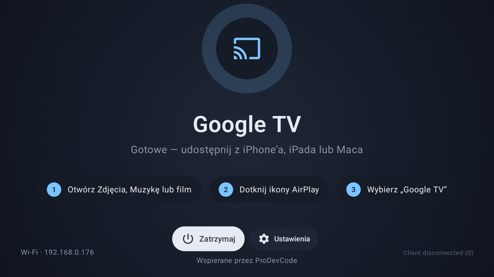
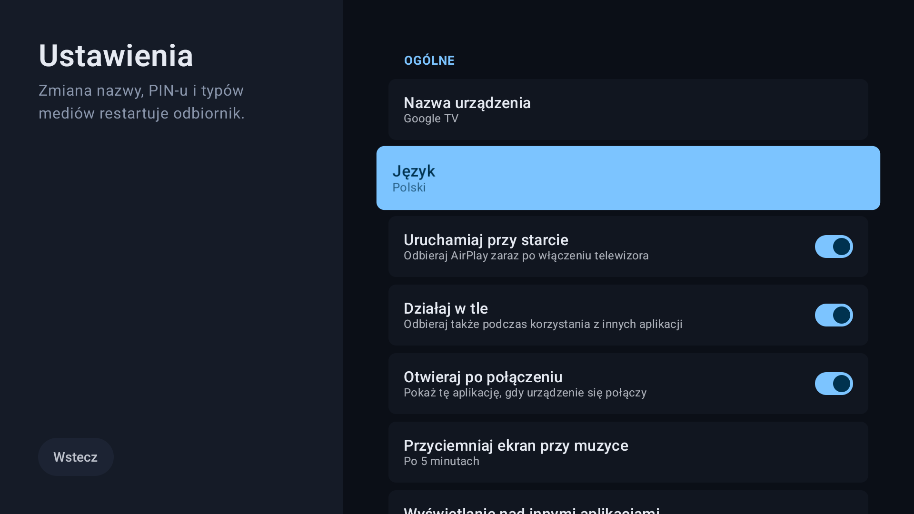
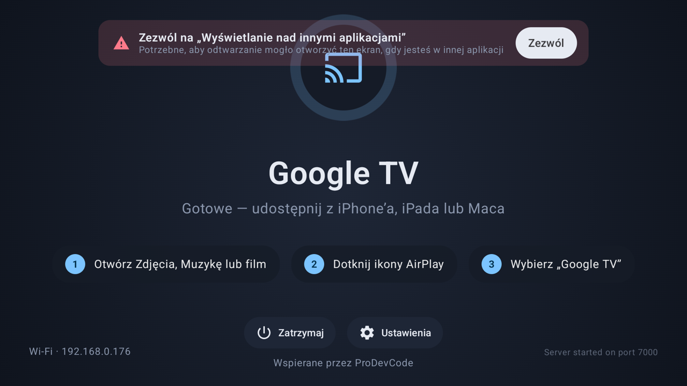
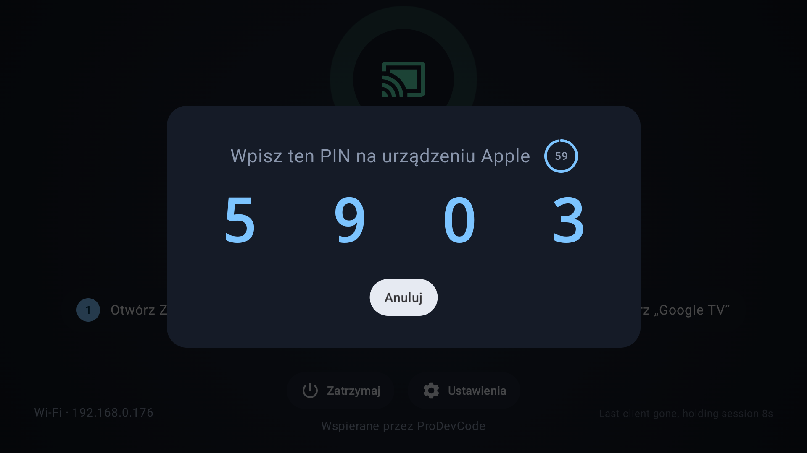
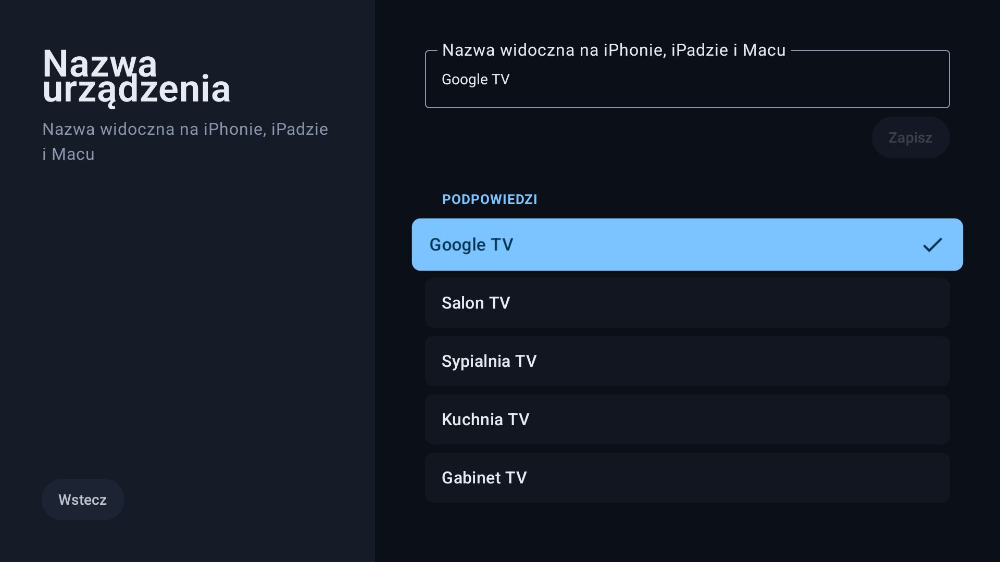

<div align="center">

# AirPlay for Google TV

**Darmowy, otwarty odbiornik AirPlay dla Google TV / Chromecasta**
Zdjęcia, muzyka i wideo z iPhone’a, iPada lub Maca — prosto na duży ekran.

[](https://github.com/mkatadev/GoogleTVAirPlay/releases/latest)
[](https://github.com/mkatadev/GoogleTVAirPlay/actions/workflows/ci.yml)
[](LICENSE)


[🇬🇧 English](README.md) · 🇵🇱 Polski



</div>

## Funkcje

- 📺 **Mirroring ekranu** z iPhone’a, iPada i Maca
- 🎬 **Wideo i zdjęcia** — telewizor sam odtwarza strumień (HLS), przewijanie pilotem, **wybór ścieżki audio i napisów**
- 🎵 **Muzyka** — widoczny jako głośnik AirPlay, z okładką i informacjami o utworze
- ⚡ **Dekodowanie sprzętowe** — H.264 i HEVC (H.265), gdy telewizor to wspiera
- ⏱️ **Presety opóźnienia** — Niskie / Zrównoważone / Płynne, przełączane na żywo (gry vs. słabe Wi-Fi)
- 🔒 **Parowanie PIN-em** (domyślnie włączone) — urządzenia, które raz wpisały PIN, są zapamiętywane; zarządzasz nimi w *Ustawienia → Zaufane urządzenia*
- 🩺 **Diagnostyka** — sprawdzenie odbiornika, sieci, rozgłaszania mDNS i portu z podpowiedziami po ludzku; po zmianie sieci TV rozgłasza się ponownie automatycznie
- 🌙 **Przyciemnianie ekranu** przy muzyce (przyjazne OLED); zapauzowana sesja pozwala TV usnąć
- 🔁 **Odporność na chwilowe zerwania** — zablokowanie iPhone'a nie kończy już odtwarzania audio/wideo
- 🚀 **Działa w tle** i **startuje z telewizorem** — odbiornik zawsze gotowy
- 🔔 **Aktualizacje w aplikacji** — sprawdza GitHub Releases, pobiera podpisany APK, weryfikuje SHA-256 i przekazuje do instalatora systemowego; potwierdzasz pilotem (bez telemetrii)
- 🎛️ Zaprojektowany pod pilota: UI w Compose for TV, bez dotyku; edytor nazwy urządzenia z gotowymi podpowiedziami
- 🌍 Polski i angielski — przełączane w aplikacji (Ustawienia → Język), niezależnie od języka telewizora

<div align="center">

</div>

## Instalacja

Aplikacji nie ma w Google Play — zainstaluj APK z [**Releases**](https://github.com/mkatadev/GoogleTVAirPlay/releases/latest).

Najpierw na TV: Ustawienia → System → Informacje → 7× *Kompilacja systemu* → Opcje programisty → włącz *Debugowanie USB* (kabel) lub *Debugowanie bezprzewodowe* (Wi-Fi).

**Jedna komenda (macOS / Linux, bez Android Studio i SDK).** [`install.sh`](install.sh) pobiera adb i najnowsze APK z wydań, sprawdza SHA-256, znajduje telewizor (USB albo Wi-Fi przez mDNS), instaluje i uruchamia aplikację:

```bash
curl -fsSL https://raw.githubusercontent.com/mkatadev/GoogleTVAirPlay/main/install.sh | bash
```

```bash
./install.sh --pair                      # debugowanie bezprzewodowe (Android 11+): jednorazowe parowanie kodem z TV
./install.sh --ip 192.168.1.42[:port]    # połącz z konkretnym TV (domyślny port 5555)
./install.sh --version 1.2.0             # konkretne wydanie zamiast najnowszego
./install.sh --apk sciezka/do/pliku.apk  # lokalne APK (np. zbudowane samodzielnie)
```

Bez `--ip` skrypt sam szuka telewizora: najpierw urządzenia już widoczne dla adb (USB lub wcześniej połączone po Wi-Fi), potem usługi debugowania bezprzewodowego rozgłaszane przez mDNS w sieci lokalnej. Gdy znajdzie więcej niż jedno urządzenie, pyta, które wybrać; jeśli TV jest *unauthorized*, zaakceptuj monit o debugowanie na telewizorze i uruchom skrypt ponownie. Jeśli zainstalowana wersja jest podpisana innym kluczem, skrypt zaproponuje jej odinstalowanie. Na Windows użyj WSL.

**Ręcznie przez adb:**

```bash
adb connect <ip-telewizora>     # debugowanie bezprzewodowe — jednorazowo `adb pair <ip:port>`
adb install -r AirPlay-for-Google-TV-v*.apk
```

**Bez komputera:** skopiuj APK na pendrive albo otwórz link do wydania w menedżerze plików na TV
(np. *Downloader*, *X-plore*) i zainstaluj. Gdy TV zapyta, zezwól tej aplikacji na *Nieznane źródła*.

Po instalacji otwórz aplikację raz i przyznaj uprawnienie **Wyświetlanie nad innymi aplikacjami**, żeby odtwarzanie mogło przejąć ekran, gdy jesteś w innej aplikacji — aplikacja poprosi o nie przy pierwszym uruchomieniu:

<div align="center">


</div>

## Jak używać

1. Telewizor i urządzenie Apple muszą być w tej samej sieci Wi-Fi.
2. Otwórz Zdjęcia, Muzykę, YouTube, Safari… i dotknij ikony AirPlay.
3. Wybierz telewizor (domyślna nazwa **Google TV**, do zmiany w Ustawieniach).
4. Przy włączonym parowaniu PIN-em telewizor pokazuje 4-cyfrowy PIN przez 60 s — wpisz go na urządzeniu Apple. Zaufane urządzenia pomijają ten krok następnym razem.

<div align="center">


</div>

Podczas odtwarzania wideo: **OK** pauza/wznów · **◀ ▶** przewijanie (przytrzymaj, aby przyspieszyć) · **▲ ▼** skok ±10 % · **0–9** skok do 0–90 % · **Wstecz** stop. Jeśli strumień ma kilka ścieżek audio lub napisy, **▼** otwiera menu ścieżek.

## Budowanie ze źródeł

Wymagania: JDK 17, Android SDK 37, NDK 28.2 + CMake 3.22 (Android Studio doinstaluje na żądanie), `make`, `perl`.
Pierwszy build kompiluje OpenSSL i FFmpeg ze źródeł dla trzech ABI i trwa ~10 minut; kolejne są przyrostowe.

```bash
git clone --recurse-submodules https://github.com/mkatadev/GoogleTVAirPlay.git   # kod third-party jest w submodułach
./gradlew :app:assembleDebug           # APK debug
./gradlew :app:testDebugUnitTest       # testy jednostkowe
./gradlew installChromecast            # build release → wybór TV → instalacja i uruchomienie
```

`installChromecast` sam skanuje urządzenia (USB, adb po Wi-Fi przez mDNS, port 5555 w lokalnych podsieciach /24) i przy kilku pyta, którego użyć — Enter powtarza ostatni wybór. `-Pchromecast=<ip[:port]>` lub `-Pchromecast=<serial adb>` pomija skanowanie.

### Podpisywanie release

`release.keystore` + `keystore.properties` w katalogu projektu (oba gitignored) podpisują build release; bez nich release jest podpisywany kluczem debug.

```bash
keytool -genkeypair -keystore release.keystore -alias tvairplay -keyalg RSA -keysize 4096 -validity 10000
```

`keystore.properties`: `storeFile=release.keystore`, `storePassword`, `keyAlias`, `keyPassword`. Zrób kopię zapasową — APK podpisany innym kluczem nie zaktualizuje aplikacji zainstalowanej na TV.

### Wydawanie (CI)

Wypchnięcie tagu publikuje podpisany APK + SHA-256 w GitHub Releases ([`release.yml`](.github/workflows/release.yml)):

```bash
git tag v1.2.0 && git push origin v1.2.0
```

`versionName` pochodzi z tagu, a `versionCode` jest z niego wyliczany (`1.2.3 → 10203`). Workflow wymaga sekretów repozytorium: `KEYSTORE_BASE64` (`base64 -i release.keystore`), `KEYSTORE_PASSWORD`, `KEY_ALIAS`, `KEY_PASSWORD`. *Run workflow* w zakładce Actions buduje podpisany APK jako artefakt bez publikowania wydania. Każdy push i PR uruchamia [`ci.yml`](.github/workflows/ci.yml) (testy jednostkowe + build debug).

## Architektura

```
:airplay-core  (biblioteka Android, NDK/CMake)
  src/main/cpp/            most JNI, silnik audio, shim dnssd; third_party/ submoduły (UxPlay, libplist, FFmpeg, openssl-cmake)
  pl.prodevcode.airplay    AirPlayService (cienki host) + współpracownicy: VideoSession, NowPlayingState, VolumeSync,
                           MediaSessionController, ServiceNotifications, NsdServiceManager, NetworkWatcher, renderery

:app  (tylko Google TV, Compose for TV, Clean Architecture + MVI)
  domain/         model · interfejsy repozytoriów · use case'y     ← czysty Kotlin, bez android.* (tylko javax.inject)
  data/           ReceiverRepositoryImpl (binduje AirPlayService), SettingsRepositoryImpl, DeviceInfoRepositoryImpl
  platform/       porty specyficzne dla Androida poza domeną (VideoSurfaceHost)
  presentation/   per ekran: Contract (UiState · Intent · Effect) + MviViewModel + composable Screen/Content (+ @Preview)
                  settings/ to hub; każde pod-ustawienie (nazwa urządzenia, język, …) ma własny ekran i ViewModel
  di/             bindingi Hilt
```

Każdy ekran to jeden niemutowalny `UiState` renderowany przez bezstanowy composable `Content`; UI wysyła `Intent`y
do ViewModelu, który redukuje stan i emituje jednorazowe `Effect`y (nawigacja). ViewModele mają testy jednostkowe
(`app/src/test`, JUnit 4 + coroutines-test + MockK + Turbine).

Stack: AGP 9.4 (wbudowany Kotlin), Compose BOM 2026.09 + `androidx.tv:tv-material`, Hilt, KSP, Media3, Coroutines/Flow.

### Kod third-party i aktualizacje

`airplay-core/src/main/cpp/third_party/` to submoduły git przypięte do konkretnych commitów upstreamu — patrz
[`third_party/VERSIONS.md`](airplay-core/src/main/cpp/third_party/VERSIONS.md). Lokalne poprawki do UxPlay leżą w
`airplay-core/src/main/cpp/patches/UxPlay/*.patch` i są nakładane podczas konfiguracji CMake na kopię w katalogu
build — same submoduły pozostają nietknięte.

```bash
tools/third-party.sh status                    # przypięta wersja każdego komponentu vs. co ma upstream
tools/third-party.sh update UxPlay v1.75       # podbij jeden komponent (tag / gałąź / sha), sprawdź patche, odśwież VERSIONS.md
tools/third-party.sh update ffmpeg n9.0.2
tools/third-party.sh verify-patches            # czy patche UxPlay nadal nakładają się na przypięty commit?
tools/third-party.sh rebase-patches            # roboczy checkout do naprawy patchy, które przestały się nakładać
```

Po aktualizacji: build, test na TV, commit wskaźnika submodułu razem z `VERSIONS.md`. CI odrzuca nieaktualny
`VERSIONS.md` i niedziałające patche. Sklonowane bez `--recurse-submodules`? Krok konfiguracji CMake sam uruchomi
`git submodule update --init`. *Download ZIP* na GitHubie **nie** zawiera submodułów — użyj `*-full-source.tar.gz` z Releases.

## Licencja

**GPL-3.0** — patrz [LICENSE](LICENSE). Rdzeń AirPlay wywodzi się z [UxPlay](https://github.com/FDH2/UxPlay) i
[jqssun/android-airplay-server](https://github.com/jqssun/android-airplay-server); informacje o komponentach zewnętrznych są w [`airplay-core/NOTICE.md`](airplay-core/NOTICE.md) oraz w aplikacji: *Ustawienia → Licencje open source*.

AirPlay jest znakiem towarowym Apple Inc. Projekt nie jest powiązany z Apple ani Google.

---

<div align="center">

Wspierane przez **ProDevCode** · [prodevcodepl@gmail.com](mailto:prodevcodepl@gmail.com) · [github.com/mkatadev](https://github.com/mkatadev)

</div>
